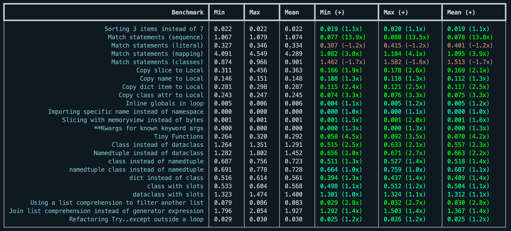

# rich-bench

A little Python benchmarking tool.

## Why do I need this?

The builtin timeit module for Python is great, but the typical usage for micro-benchmarks is to run a small script like this:

`python -m timeit "a = 1; b = 2; a * b"`

The problem with this approach is that the compiled code is a module, so any variables on the top-level are **globals**. 
The compiled bytecode is different to the same statements being inside a local scope (e.g. a method or function).
They behave and perform very differently in CPython.

`richbench` encourages you to write benchmarks inside functions to properly simulate the closures and scope of production code.

## Installation

Requires Python 3.7+ 

```pip install richbench```

## Usage

Write your benchmark functions in a directory and run `richbench` with that target to get the results:

```console
$ richbench my_benchmarks/
```

Results are displayed in a table like this:




```console
$ richbench --help
usage: richbench [-h] [--profile] [--percentage] [--benchmark [BENCHMARK]] [--repeat REPEAT] [--times TIMES] target [target ...]

positional arguments:
  target

options:
  -h, --help            show this help message and exit
  --profile             Profile the benchmarks and store in .profiles/
  --percentage          Show percentage of improvement instead of multiplier
  --benchmark [BENCHMARK]
                        Run specific benchmark
  --repeat REPEAT       Repeat benchmark this many times
  --times TIMES         Run benchmark this many times
```

## Writing benchmarks

Benchmarks should be in a directory and must have the filename `bench_{name}.py`.

The last statement in the benchmark file should be a list, called `__benchmarks__` with a list of tuples containing:

1. function a
1. function b
1. the name of the benchmark

```python
def sort_seven():
    """Sort a list of seven items"""
    for _ in range(10_000):
        sorted([3,2,4,5,1,5,3])

def sort_three():
    """Sort a list of three items"""
    for _ in range(10_000):
        sorted([3,2,4])

__benchmarks__ = [
    (sort_seven, sort_three, "Sorting 3 items instead of 7")
]
```

### Tips for benchmarking

Inside your benchmark function try to:

* Run setup commands once
* Repeat the code you want to benchmark as many times as possible to create a stable benchmark

For micro-benchmarks, this can be achieved by calling 1000 - 100,000 times.

If your benchmark code completes within `0.001s` it is likely you will get unstable benchmarks because of the CPU doing other activities. Increase the times the target code is run within the function.

## Profiling

By adding the `--profile` flag to the command line, it will generate a subdirectory `.profiles` with HTML profile data of your target functions.
